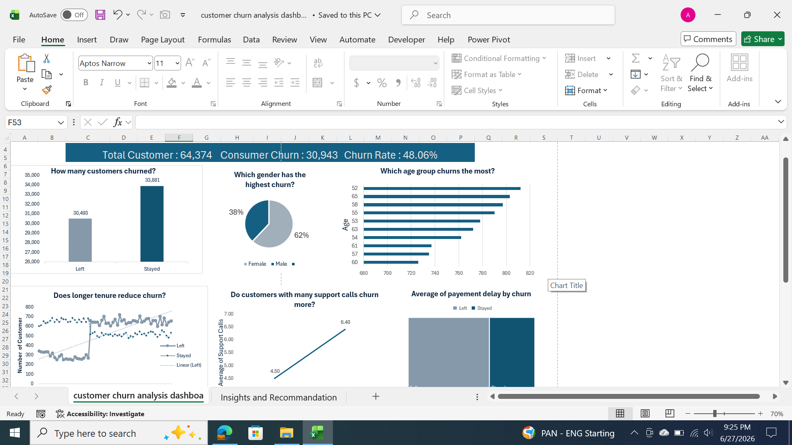

# 📊 Customer Churn Analysis Dashboard

## 📌 Project Overview

Customer retention is one of the most important challenges for subscription-based businesses. This project analyzes customer churn data to identify patterns, understand the factors associated with customer churn, and provide actionable business recommendations.

The dashboard was developed using Microsoft Excel and Power BI, incorporating DAX measures, Power Query, PivotTables, and interactive visualizations.

---

## 🎯 Business Problem

Customer churn directly impacts business revenue and growth. The objective of this analysis is to answer key business questions such as:

- What is the overall churn rate?
- Which customer groups have the highest churn?
- Does contract length influence churn?
- Do payment delays increase churn?
- Does customer tenure reduce churn?
- How do support calls affect churn?

---

## 📂 Dataset

The dataset contains customer demographic information, subscription details, customer behavior, and churn status.

### Features

- Customer ID
- Age
- Gender
- Tenure
- Usage Frequency
- Support Calls
- Payment Delay
- Subscription Type
- Contract Length
- Total Spend
- Last Interaction
- Churn

---

## 🛠 Tools & Technologies

- Microsoft Excel
- Power Query
- Power Pivot
- DAX
- Pivot Tables
- Pivot Charts
 _ Data Cleaning 
  Data Visualization

## 📈 Dashboard KPIs

- Total Customers
- Churned Customers
- Customer Retention
- Churn Rate

---

## 📊 Dashboard Visualizations

- Customer Churn Distribution
- Churn by Gender
- Churn by Age Group
- Customer Tenure Analysis
- Support Calls vs Churn
- Payment Delay Analysis

---

## 📌 Key Insights

- The overall churn rate is **48.06%**.
- Female customers represent a higher percentage of churn than male customers.
- Customers around the ages of **52–65** show relatively higher churn counts.
- Customers with more support calls tend to have higher churn.
- Longer customer tenure is generally associated with better retention.
- Payment delay shows only a small difference between churned and retained customers, suggesting it may not be a strong predictor on its own.

---

## 💡 Business Recommendations

- Improve customer support quality to reduce repeated support requests.
- Develop targeted retention campaigns for customer groups with higher churn.
- Encourage customers to commit to longer-term contracts.
- Implement loyalty programs for long-tenure customers.
- Monitor customers with frequent support calls and proactively address their issues.
- Combine multiple customer behavior indicators when identifying customers at risk of churning.

---

## 📷 Dashboard Preview

## 📁 Repository Structure

customer-churn-analysis-dashboard/

│── Customer Churn Analysis Dashboard.xlsx

│── Dashboard.png

│── README.md

## 🚀 Skills Demonstrated

- Data Cleaning
- Data Transformation
- Exploratory Data Analysis (EDA)
- DAX Measures
- KPI Development
- Dashboard Design
- Business Intelligence
- Data Visualization
- Business Insights
- Excel Analytics
